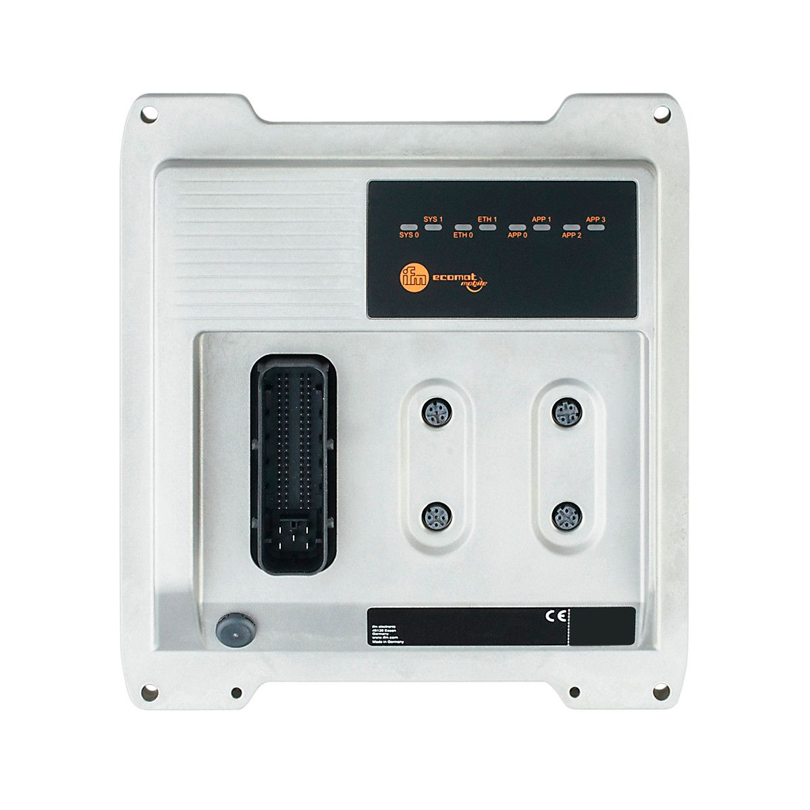
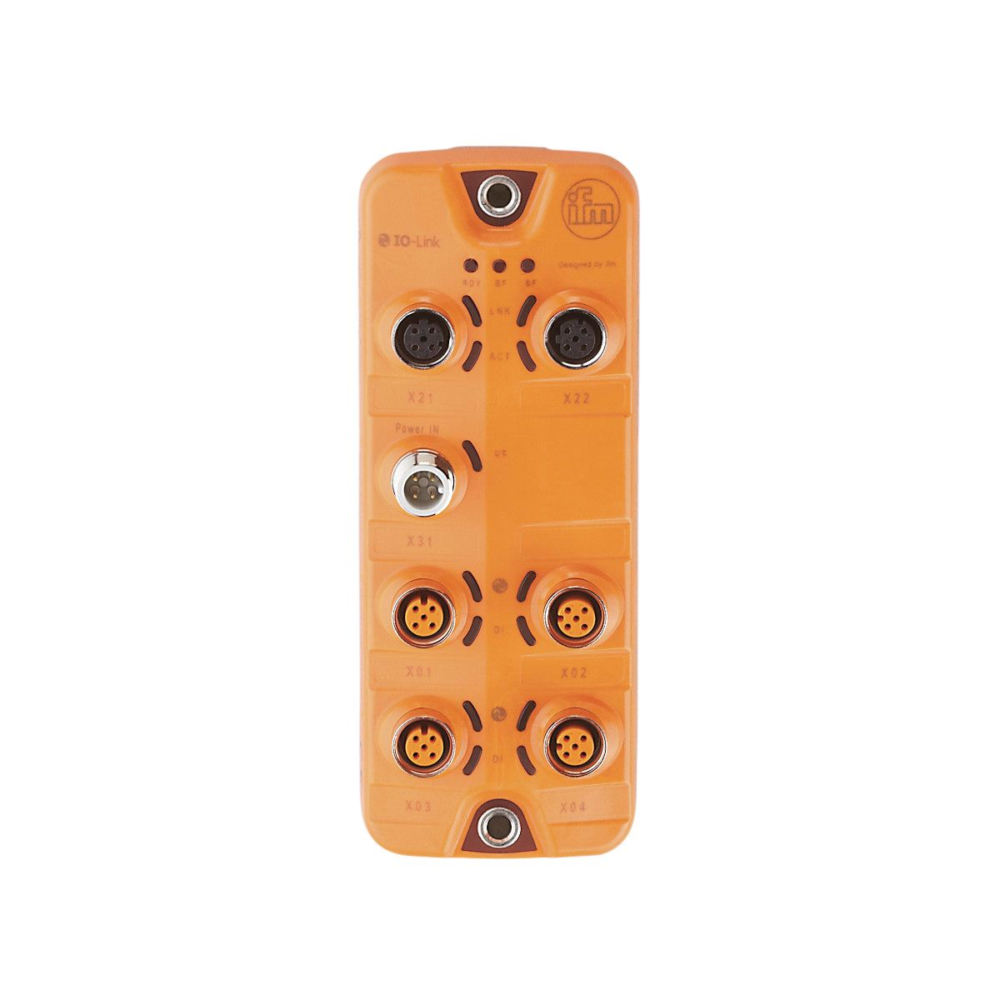
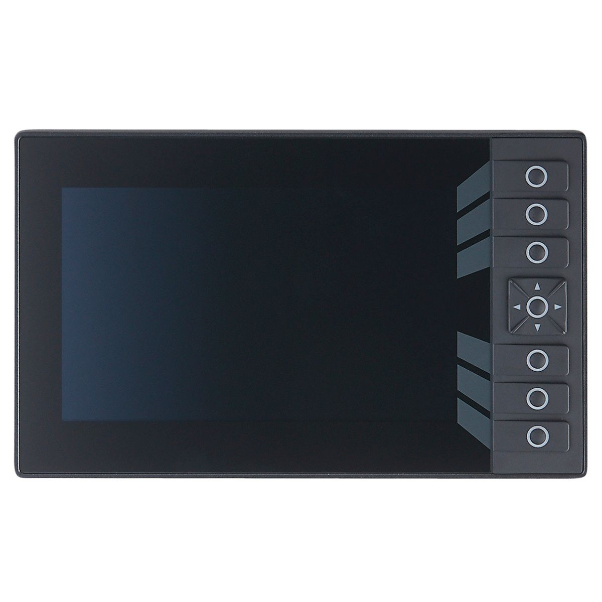
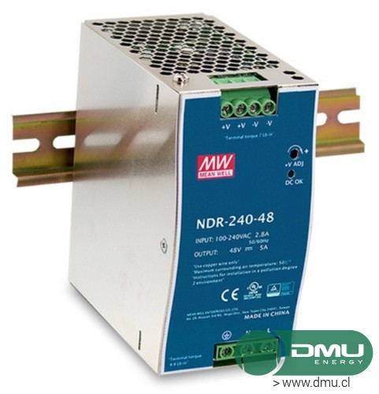

# Lista de Materiales
## Tablero 

| Lista de Materiales Tablero               |                                    |
| ----------------------------------------- |:------------------------------:    |
| [PLC IFM CR710S](https://www.ifm.com/es/es/product/CR710S)|     |
| [IO-LINK IFM AL1120](https://www.ifm.com/de/en/product/AL1120)|     |
| [PANTALLA HMI CR1077](https://www.ifm.com/es/es/product/CR1077) |    |
| [FUENTE DE VOLTAJE](http://dmu.cl/fuentes-de-poder/fuentes-de-poder-24vdc/fuente-poder-24v-10a-riel-din-ndr-240-24)|    |
|            |      |
|            |      |
|            |      |
|            |      |
|            |      |
|            |      |
|            |      |
|            |      |

<table>

 <tr>
    <td align="center" > <a href="https://www.ifm.com/es/es/product/CR710S"> 
     
    </td>
    <td align="center" > <a href="https://www.ifm.com/de/en/product/AL1120">
     
    </td>
 </tr>

 <tr>
    <td align="center" > <a href="http://dmu.cl/fuentes-de-poder/fuentes-de-poder-24vdc/fuente-poder-24v-10a-riel-din-ndr-240-24">
     
    </td>
    <td align="center" > <a href="https://www.ifm.com/es/es/product/CR1077"> </td>
 </tr>

</table>

## Módulo Portátil

> Documentacion [Markdown]( https://github.com/adam-p/markdown-here/wiki/Markdown-Here-Cheatsheet "Documentación Markdown")