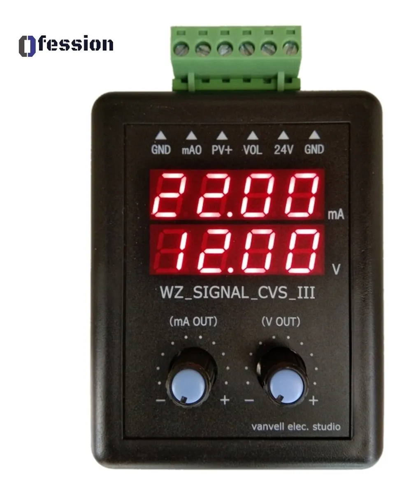
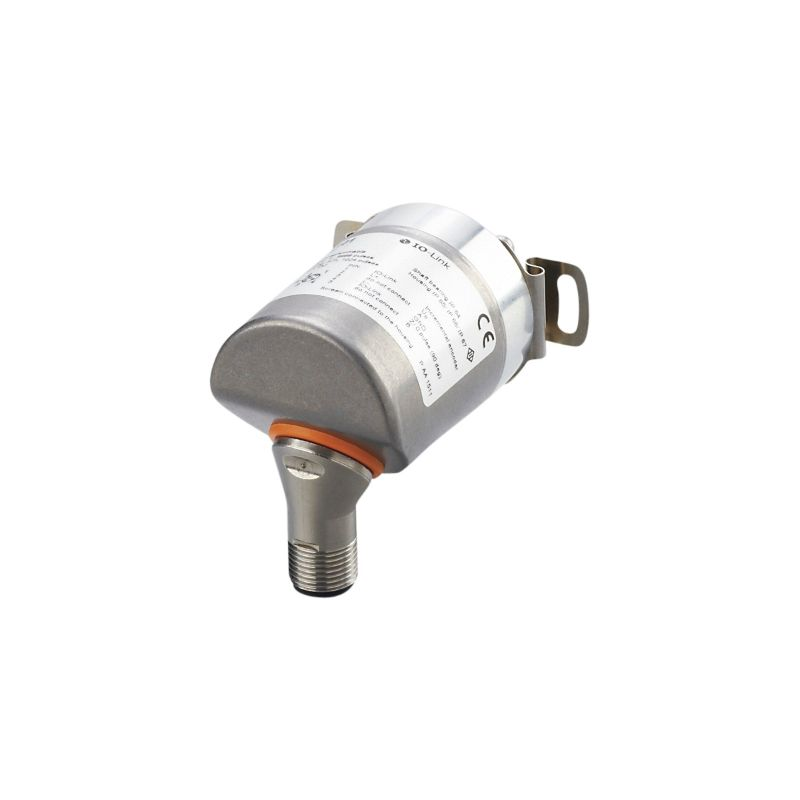

# Lista de Materiales
## Tablero Principal

| Item | Lista de Materiales Tablero |Imágen Referencial | Cantidad |
| -----| :-------------------------- | :-----------:     | --------:|
|1| [PLC IFM CR710S](https://www.ifm.com/es/es/product/CR710S) || 1 |
|2| [IO-LINK IFM AL1120](https://www.ifm.com/de/en/product/AL1120)| | 1 |
|3| [PANTALLA HMI CR1077](https://www.ifm.com/es/es/product/CR1077) | | 1 |
|4| [FUENTE DE VOLTAJE](http://dmu.cl/fuentes-de-poder/fuentes-de-poder-24vdc/fuente-poder-24v-10a-riel-din-ndr-240-24)|| 1 |
|5|   |   |
|6|   |   |
|7|   |   |
|8|   |   |
|9|   |   |
|10|  |   |
|11|  |   |
|12|  |   |

## Tablero Secundario

| Item | Lista de Materiales Tablero |Imágen Referencial | Cantidad |
| -----| :-------------------------- | :-----------:     | --------:|
|1| [JOYSTICKS APEM HF SERIES](https://www.apem.com/us/hf-series-42.html) || 1 |
|2| [MOTOR HG37-010-AB-00](https://www.mouser.pe/ProductDetail/Nidec-Copal/HG37-010-AB-00?qs=Wj%2FVkw3K%252BMDXk9B7HZtFzg%3D%3D)| | 1 |
|3| [GEENERADOR DE SEÑAL](https://articulo.mercadolibre.com.pe/MPE-442409083-generador-senal-corriente-4-20ma-voltaje-0-10-v-plc-sensor-_JM#reco_item_pos=0&reco_backend=machinalis-seller-items&reco_backend_type=low_level&reco_client=vip-seller_items-above&reco_id=ba668242-c660-4e1a-baad-076690d5d803) | | 1 |
|4| [ENCODER IFM RA3101](https://www.ifm.com/es/es/product/RA3101)|| 1 |
|5|   |   |
|6|   |   |
|7|   |   |
|8|   |   |
|9|   |   |
|10|  |   |
|11|  |   |
|12|  |   |

> Documentacion [Markdown]( https://github.com/adam-p/markdown-here/wiki/Markdown-Here-Cheatsheet "Documentación Markdown")